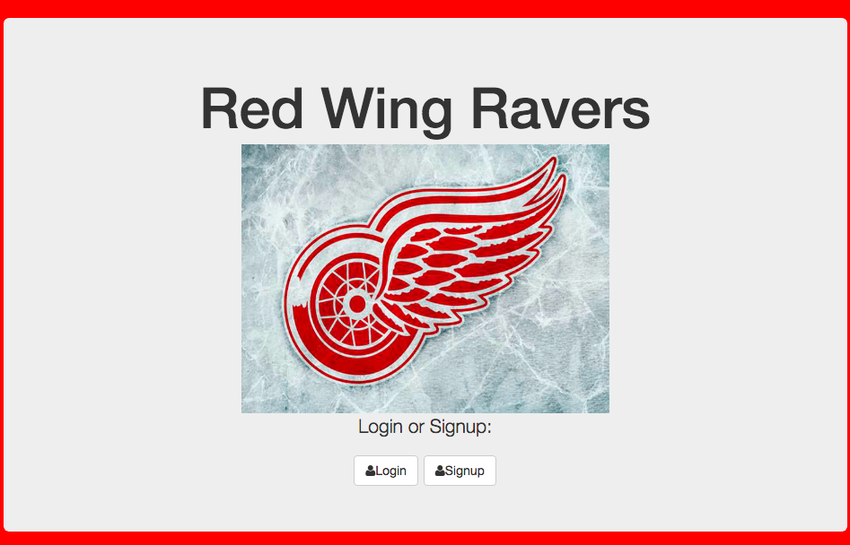

# PracticeUserAuthExpress

## How It's Made:

**Tech used:** HTML, CSS, JavaScript, Express

Shout your love for the Red Wings and other users can vote if your praises are worthy or not by adding and subtracting likes.

## Lessons Learned:

User autherization was amazing to learn. A real in depth chance of understanding endpoints and routings and getting icons with click events to add, subtract, or delete.
